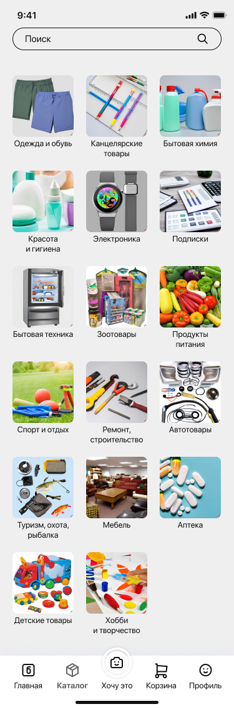
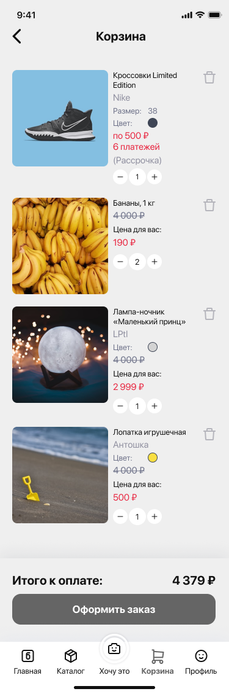
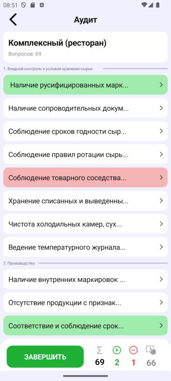
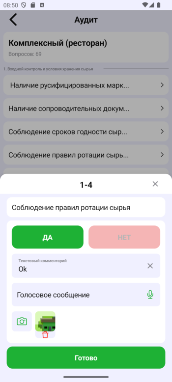
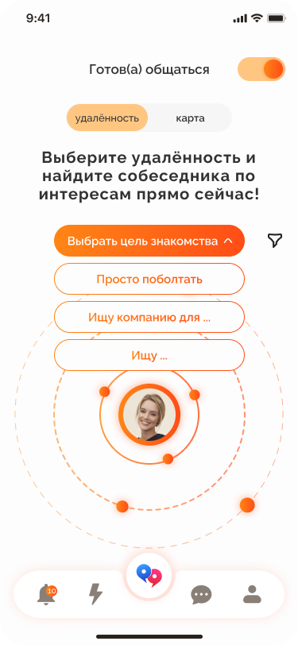

# ipbandroidview


Библиотека компонентов и готовых экранов с современным дизайном и интеграцией с [iProBonus API](https://github.com/progressterra/ipbandroidapi) для вашего приложения!

# Содержание
- [ipbandroidview](#ipbandroidview)
- [Содержание](https://github.com/progressterra/ipbandroidview/blob/fsd_and_uikit/README.md#%D0%A1%D0%BE%D0%B4%D0%B5%D1%80%D0%B6%D0%B0%D0%BD%D0%B8%D0%B5)
- [Кому пригодится ipbAndroidView?](https://github.com/progressterra/ipbandroidview/blob/fsd_and_uikit/README.md#%D0%9A%D0%BE%D0%BC%D1%83-%D0%BF%D1%80%D0%B8%D0%B3%D0%BE%D0%B4%D0%B8%D1%82%D1%81%D1%8F-ipbAndroidView?)
- [Примеры использования](https://github.com/progressterra/ipbandroidview/blob/fsd_and_uikit/README.md#%D0%9F%D1%80%D0%B8%D0%BC%D0%B5%D1%80%D1%8B-%D0%B8%D1%81%D0%BF%D0%BE%D0%BB%D1%8C%D0%B7%D0%BE%D0%B2%D0%B0%D0%BD%D0%B8%D1%8F)
- [Использование](https://github.com/progressterra/ipbandroidview/blob/fsd_and_uikit/README.md#%D0%98%D1%81%D0%BF%D0%BE%D0%BB%D1%8C%D0%B7%D0%BE%D0%B2%D0%B0%D0%BD%D0%B8%D0%B5)

# Кому пригодится ipbAndroidView?
- Компаниям, создающим приложения в сфере Ecommerce, Checklist, Dating
- Компаниям, желающим как можно быстрее вывести MVP на рынок

# Примеры использования
## Ecommerce
  
## HACCP
  
## Я тут!
  
# Использование
## Получение ключа доступа
Для получения заполните [форму](https://progressterra.com/)
## Добавление репозитория библиотек
Если используется Groovy
```groovy
maven {
    name "GitHubPackages"
    url "https://maven.pkg.github.com/progressterra/ipbandroidview"
    credentials {
        username project.findProperty("gpr.user")
        password project.findProperty("gpr.key")
    }
}
```
Или же, если используется Kotlin Gradle DSL. [Видеоурок](https://youtu.be/o-G_xPw7W-Q)
```kotlin
maven {
    name = "GitHubPackages"
    url = uri("https://maven.pkg.github.com/progressterra/ipbandroidview")
    credentials {
        username = project.findProperty("gpr.user") as String
        password = project.findProperty("gpr.key") as String
    }
}
```
## Добавление библиотеки
Если используется Groovy
```groovy
dependencies {
    implementation "com.github.skydoves:landscapist-coil:$version"
}
```
Или же, если используется Kotlin Gradle DSL
```kotlin
dependencies {
    implementation("com.github.skydoves:landscapist-coil:$version")
}
```
## Кофигурационный файл `config.properties`, находящийся в корневой папке проекта (в одноименный файл скопировать содержимое ниже)
```
# Индивидуальный ключ для доступа к платформе
accessKey=xxxxxxxx-xxxx-xxxx-xxxx-xxxxxxxxxxxx
# Ссылка на публичную оферту
offerUrl=https://iprobonus.com/
# Ссылка на политику конфедициальности
privacyUrl=https://iprobonus.com/
# Используемые в приложении цвета в hex формате. Если через запятую перечисляются два цвета, будет создан линейный горизонтальный градиент
primary=#35C290,#2E9399
secondary=#3E4555
secondary2=#CDCDD6
secondary3=#DCE8FF,#FFFFFF
tertiary=#B5B5BC
background=#F2F5FF
onBackground=#2E8E6C
onBackground2=#1A1A20
surface=#FFFFFF
surface2=#111111
onSurface=#FFFFFF
onSurface2=#101010
primaryPressed=#3D3D3D
primaryDisabled=#E4E4F0
secondaryPressed=#232427
error=#DF3636
success=#7ADB6B
info=#6980CF
warning=#DB742A
textPrimary=#111111
textPrimary2=#E82741
textPrimary3=#35C290,#2E9399
textSecondary=#6E7289
textTertiary=#9191A1
textTertiary2=#453896
textTertiary3=#28AB13
textTertiary4=#CA451C
textButton=#FFFFFF
textDisabled=#B5B5B5
textPressed=#24282E
iconPrimary=#111111
iconPrimary2=#E82741
iconPrimary3=#35C290,#2E9399
iconSecondary=#FFFFFF
iconSecondary2=#FFFFFF
iconTertiary=#B5B5BC
iconTertiary2=#4578DC,#453896
iconTertiary3=#B2FF75,#28AB13
iconTertiary4=#F6E651,#B80707
iconTertiary5=#1A1A20
iconPressed=#0F1215
iconDisabled=#B5B5B5
iconDisabled2=#EDF1FF
# Идентификаторы категорий, которые будут показаны на главном экране в соответствующем порядке
mainCategories=08db73df-fe78-4081-8ddf-e3646c33a2f7,08db73e0-6491-4112-8358-f524fbc64e72,08db73e0-70e5-49ab-80a7-680d3bd62600
# Хосты приложения, через запятую можно указать любое количество запасных для большей отказоустойчивости
productUrl=http://51.250.54.134:7023/,http://55.250.54.135:7023/
docsUrl=http://51.250.54.134:7107/
catalogUrl=http://51.250.54.134:7027/
cartUrl=http://51.250.54.134:7025/
balanceUrl=http://51.250.54.134:7009/
messengerUrl=http://51.250.54.134:7093/
paymentDataUrl=http://51.250.54.134:7095/
paymentUrl=http://51.250.54.134:7097/
scrmUrl=http://51.250.54.134:7021/
authUrl=http://51.250.54.134:7001/
mediaDataUrl=http://51.250.54.134:7089/
imhUrl=http://51.250.54.134:7701/
workWatchUrl=http://51.250.54.134:7103/
# Закругление кнопок в dp
buttonRounding=14
# Включена ли фукнция WorkWatch
workWatchEnabled=true
# Ключ для Яндекс Карты
yandexMapApiKey=2681c223-82e2-4e4d-a4fe-48a67f3fb97b
# Поля профиля, доступные и/или обязательный для ввода. Значения: name, soname, patronymic, sex, dateOfBirth, eMailGeneral
availableProfileFields=name,soname,dateOfBirth
mandatoryProfileFields=name,soname,dateOfBirth
```
## Чтение конфигурационного файла
Если используется Groovy
```groovy
String createConfigField() {
    String path = new File("$rootDir/config.properties").absolutePath
    Properties props = new Properties()
    props.load(new FileInputStream(path))
    StringBuilder sb = new StringBuilder()
    sb.append("new java.util.HashMap<String, java.util.List<String>>() {{\n")
    props.each { key, value ->
        List<String> list = value.split(",")
        String joinedList = list.join('", "')
        sb.append("put(\"$key\", java.util.Arrays.asList(\"$joinedList\"));\n")
    }
    sb.append("}}")
    return sb.toString()
}
```
Или же, если используется Koltin Gradle DSL
```kotlin
fun createConfigField(): String {
    val path = File("$rootDir/config.properties").absolutePath
    val props = loadProperties(path).entries.associate {
        it.key.toString() to it.value.toString().split(",")
    }
    return buildString {
        appendLine("new java.util.HashMap<String, java.util.List<String>>() {{")
        props.forEach { (key, value) ->
            val list = value.joinToString(separator = "\", \"", prefix = "\"", postfix = "\"")
            appendLine("put(\"$key\", java.util.List.of($list));")
        }
        append("")
    }
}
```
## Добавление полей конфигурации в `BuildConfig`
1. Убедитесь, что `buildFeatures` включает наличие `BuildConfig`
Если используется Groovy
```groovy
buildFeatures {
    buildConfig true
} 
```
Или же, если используется Kotlin Gradle DSL
```kotlin
buildFeatures {
    buildConfig = true
} 
```
2. Добавьте поле `config` в `BuildConfig`. Для этого в блоке `defaultConfig`
Код идентичен для Groovy и Kotlin Gradle DSL
```kotlin
buildConfigField(
    "java.util.Map<String, java.util.List<String>>",
    "config",
    createConfigField()
)
```
## Интеграция с Firebase Cloud Messaging
1. Подключите [Google Services Gradle Plugin](https://developers.google.com/android/guides/google-services-plugin?hl=ru)
2. Наследуйте базовый класс из библиотеки и укажите его в манифесте приложения
```kotlin
class AppCloudMessagingService : CloudMessagingService() {

    override val activityClass = AppActivity::class.java
    override val channelId = "IMH NC"
    override val notificationIconId = R.drawable.ic_notification
    override val notificationNameId = R.string.app_name
}
```
```xml
<service
    android:name=".AppCloudMessagingService"
    android:exported="false">
    <intent-filter>
        <action android:name="com.google.firebase.MESSAGING_EVENT" />
    </intent-filter>
</service>
```
## Подключите нужные компоненты к своии экранам или возьмите готовые
Раздел дополняется
